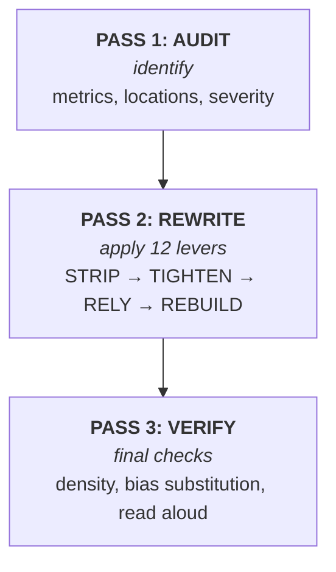
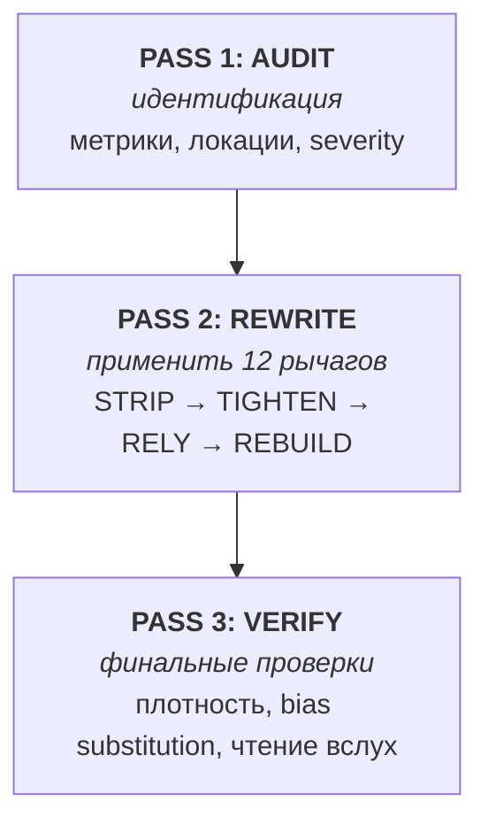

> [!info] **Language / Язык**
>
> 🇬🇧 **[English](#en-home)** · current page
>
> 🇷🇺 **[Русский](#ru-home)** · перейти на русскую версию

---

<a id="en-home"></a>

# 🖋 Agents Writing Skills

> **Skills and prompts that make AI-generated text read like a human wrote it.**
>
> Research-grounded. Open source. Works with opencode, pi, Claude Code, and any [Agent Skills-compatible](https://agentskills.io) agent.

<br>

<div align="center">

```bash
# Tell your agent, in any language:
Clone https://github.com/11111000000/agents-writing-skills
and install the skills from manifest.json
```

No shell scripts. No hardcoded paths. Any agent, any OS.

</div>

<br>

---

## 🎯 The problem

AI text has tells. Every LLM uses the same repertoire: em-dashes everywhere, rule-of-three, hedging, negative parallelisms («это не X, а Y»), "it could be argued that…". Readers spot it. Detectors flag it. Your agent's output gets prefixed with `>` and labeled "AI-written" in seconds.

## ✨ The solution

Four research-grounded skills that build on **12 humanization levers**, **43 pattern categories**, and **academic literature on length bias, defamiliarization, and iceberg theory**.

| Skill | What it does | When to load |
|---|---|---|
| 🖊 **`humanize-writer`** | Write new prose without AI tells | "Help me write a README/blog/email" |
| ✏ **`humanize-editor`** | Rewrite existing text to read human | "Rewrite my draft" |
| 🔍 **`anti-ai-auditor`** | Diagnose without rewriting | "Is this too AI?" |
| 🩹 **`ai-pattern-rewriter`** | Fix specific phrases surgically | "Fix just this paragraph" |

Plus **9 prompt templates** for pi (`/humanize`, `/audit-ai`, `/audit-43`, `/clean-draft`, `/rewrite-ai`, etc.).

---

## 🏗 How it works (3-pass architecture)

Every skill uses a **3-pass workflow** with clear inputs/outputs:



**12 levers organized in 4 phases:**

| Phase | Levers | What they do |
|---|---|---|
| 🧹 **STRIP** | 1-9 | Remove AI tells (delve, leverage, hedging, em-dash, etc.) |
| 📐 **TIGHTEN** | 10 | Sufficiency — cut-test, Williams 6 operations |
| 🧊 **RELY** | 11 | Iceberg — leave gaps the reader fills |
| 🇷🇺 **REBUILD** | 12 | Russian grammar — парцелляция, эллипсис, литота (RU only) |

> [!warning] Bias substitution (Lamparth et al., 2026)
> After TIGHTEN pass, **check for fact loss**. Single-axis length reduction can shift bias to confidence calibration. Skill v6 keeps automatic fact-extraction verification.

---

## 📚 Knowledge base

41+ Obsidian-format notes in [`knowledge/`](https://github.com/11111000000/agents-writing-skills/tree/main/knowledge), browsable here or in Obsidian. Browse the [Knowledge Base tour →](knowledge-base)

<details>
<summary><b>📑 Browse categories</b></summary>

### Patterns (43 categories)

- **P1-P10** Lexical & structural (delve, em-dash, hedging, rule-of-three, etc.)
- **P11-P20** Voice & format (impersonality, balancеd framing, lists)
- **P21-P30** Interaction & content (chatbots, hallucinations, generic conclusions)
- **P31-P43** Emerging 2024-2026 (graceful hedging, treadmill effect, etc.)
- **P-NEW-1…7** Over-generation patterns (vacuum-filling, restatement chains, bridging, etc.)
- **🇷🇺 Russian-specific** (деепричастия, парные синонимы, канцелярит)
- See [43-patterns-catalogue](01-patterns/43-patterns-catalogue) for full listing

### Techniques

- [`perplexity-and-burstiness`](02-techniques/perplexity-and-burstiness) — fundamental metrics
- [`voice-and-tone`](02-techniques/voice-and-tone) — finding voice
- [`show-dont-tell`](02-techniques/show-dont-tell) — concreteness vs abstraction
- [`sufficiency-and-underspecification`](02-techniques/sufficiency-and-underspecification) — Grice + Hemingway iceberg
- [`length-bias-research`](02-techniques/length-bias-research) — 5 academic papers
- [`russian-brevity-grammar`](02-techniques/russian-brevity-grammar) — Lever 12 deep dive
- [`laconic-prose-models`](02-techniques/laconic-prose-models) — Tolstoy, Dovlatov, Shklovsky, Bunin

### Sources (raw research)

- `06-Sources/research-papers/length-bias/` — Park, Shen, Zhang, Lamparth, Huang
- `06-Sources/web-fetches/russian-grammar/` — Парцелляция, эллипсис, литота
- `06-Sources/web-fetches/laconic-prose/` — Шкловский

### Examples (worked cases with metrics)

- `04-Examples/tightening/` — 5 README/email/blog/marketing/status rewrites
- `04-Examples/iceberg/` — 3 architecture/bugfix/codereview
- `04-Examples/russian-grammar/` — 5 Lever 12 transformations (incl. Shklovsky/Tolstoy)

</details>

---

## 🚀 Install

### For opencode / pi / Claude Code / any Agent Skills-compatible agent

```bash
# 1. Tell your agent:
#    "Clone https://github.com/11111000000/agents-writing-skills and
#     install the skills from manifest.json"

# 2. Or, manual install:
git clone https://github.com/11111000000/agents-writing-skills.git
cd agents-writing-skills

# Install specific skill:
cp -r skills/humanize-writer/ ~/.config/opencode/skills/
cp -r skills/humanize-editor/ ~/.config/opencode/skills/
cp -r skills/anti-ai-auditor/ ~/.config/opencode/skills/
cp -r skills/ai-pattern-rewriter/ ~/.config/opencode/skills/

# For pi agents, also copy prompts:
cp prompts/*.md ~/.pi/agent/prompts/
```

> [!tip] Skills reference knowledge via GitHub URLs
> All skill references use `https://github.com/11111000000/agents-writing-skills/blob/main/knowledge/...` — no local file dependencies. For **offline** access, run `./scripts/install-knowledge.sh`.

### Offline (no internet during agent runs)

```bash
./scripts/install-knowledge.sh
# Clones knowledge base to ~/.cache/agents-writing-skills-knowledge
# Then set KNOWLEDGE_PATH for offline resolution
```

---

## 🧪 Validation & testing

The skill suite is **self-validating**:

```bash
bash scripts/validate-skills.sh   # checks frontmatter, structure
bash scripts/validate-manifest.sh # checks paths in manifest.json
bash scripts/test-benchmark.sh    # smoke-tests benchmark-skill.sh
bash scripts/benchmark-skill.sh file.txt  # measure YOUR text
```

A real benchmark run on AI-typical text returns:

```
╔════════════════════════════════════════════════════════════════╗
║              SKILL BENCHMARK REPORT                             ║
╚════════════════════════════════════════════════════════════════╝

Volume:
  Words:       56
  Sentences:   4
  Paragraphs:  1

Density metrics:
  AP (negative parallelism):  0.00  per 1000 words   [target <1]
  D  (RU деепричастия):       0.0   per 1000 words   [target <7]
  E  (em-dash):               0.0   per 300 words     [target <3]
  V  (vacuum-filling):        0.0%                   [target <5%]
  B  (bridging):              0.0%  of paragraphs    [target <5%]
  YapScore:                   1.67                   [target 1.0-1.5]

Burstiness:
  Mean sentence length:       12.5 words
  Std deviation:              5.7             [target >5]
```

---

## 📊 Build on research

We aggregate **5 peer-reviewed/arXiv papers** (2023–2026) documenting that LLM length-bias is **structural**, not stylistic:

| Paper | Year | Finding |
|---|---|---|
| [Shen et al. "Loose Lips Sink Ships"](https://arxiv.org/abs/2310.05199) | 2023 | RM assumes humans prefer longer |
| [Park et al.](https://arxiv.org/abs/2403.19159) | 2024 | DPO exploits length bias; GPT-4 judge has verbosity bias |
| [Zhang et al.](https://arxiv.org/abs/2409.11704) | 2024 | Format bias (lists, bold, emojis); <1% biased data injects bias |
| [Huang et al.](https://arxiv.org/abs/2409.17407) | 2024 (ICLR 2025) | Post-hoc calibration without retraining |
| [Lamparth et al.](https://arxiv.org/abs/2605.27996) | 2026 (Stanford) | **Critical:** single-axis mitigation → bias substitution; factual accuracy falls |

Plus:
- Russian formalist [Shklovsky «Art as Technique», 1917](https://en.wikipedia.org/wiki/Viktor_Shklovsky) — defamiliarization through form
- Tolstoy, Dovlatov, Bunin as exemplars of Russian laconic prose

---

## 🔍 What's in the box

```
agents-writing-skills/
├── skills/                    # 4 SKILL.md files + lexicon references
│   ├── humanize-writer/       # Write prose without AI tells (v6)
│   ├── humanize-editor/       # Rewrite existing text (v6)
│   ├── anti-ai-auditor/       # Diagnostic only (v6)
│   └── ai-pattern-rewriter/   # Surgical span fixes (v6)
│
├── prompts/                   # 9 pi/agent prompt templates
│   ├── humanize.md
│   ├── audit-ai.md
│   ├── audit-43.md
│   └── ...
│
├── knowledge/                 # 41+ Obsidian notes
│   ├── 01-patterns/           # 43-pattern catalogue + Russian extensions
│   ├── 02-techniques/         # Levers, voice, brevity grammar
│   ├── 03-detection/          # How detectors work
│   ├── 04-examples/           # Worked before/after cases
│   ├── 05-references/         # Limits, self-critique
│   └── 06-sources/            # Raw research papers + web fetches
│
├── scripts/                   # Build, validate, benchmark, test
│   ├── build-site.sh          # Quartz v5 site builder
│   ├── validate-skills.sh     # CI validation gate
│   ├── benchmark-skill.sh     # Measure AI-pattern density
│   └── test-benchmark.sh      # Smoke tests
│
├── manifest.json              # Machine-readable skill catalog
├── docs/                       # This Quartz site content
└── tests/fixtures/             # AI-typical + human text samples
```

---

## 📚 Documentation

- [Getting Started](getting-started) — install + first use
- [Skills Overview](skills-overview) — 4 skills, 4 phases, 12 levers
- [Knowledge Base](knowledge-base) — tour of 41+ notes
- [Limitations](limitations) — what these skills can and cannot do
- [Contributing](contributing) — add new skills, prompts, notes

---

## 📜 License

- **Skills & prompts:** [MIT](https://github.com/11111000000/agents-writing-skills/blob/main/LICENSE)
- **Knowledge base notes:** [CC-BY-SA-4.0](https://creativecommons.org/licenses/by-sa/4.0/)
- **Sources academic papers:** as per respective publishers (arXiv, Wikipedia)

## ⚖ Honest summary

> [!warning] What these skills DO
> - Make text read as human-written to **human readers**
> - Reduce density of measurable AI tells (em-dash, hedging, rule-of-three)
> - Apply **cultural traditions** (Russian brevity grammar)
> - Provide **measurable metrics** (YapScore, AP, D, E)
> - Surface **structural risks** (bias substitution per Lamparth 2026)
>
> What they **DO NOT**
> - ❌ Guarantee passing GPTZero, Pangram, Grammarly
> - ❌ Bypass detection reliably (MASH, ACL 2026: ceiling at 92% ASR for older detectors)
> - ❌ Replace human editing for high-stakes content
> - ❌ Make AI-generated text untraceable as AI-generated
>
> Use to **write better**, not to **hide**.

---

<a id="ru-home"></a>

> 🇷🇺 **Русская версия ниже**

---

# 🖋 Agents Writing Skills *(RU)*

> **Скилы и промпты, которые делают AI-текст читаемым как человеческий.**
>
> На ресёрче. Open source. Работает с opencode, pi, Claude Code и любым агентом с поддержкой [Agent Skills](https://agentskills.io).

<br>

<div align="center">

```bash
# Скажите агенту по-русски:
Клонируй https://github.com/11111000000/agents-writing-skills
и установи скилы из manifest.json
```

Без shell-скриптов. Без хардкоженных путей. Любой агент, любая ОС.

</div>

<br>

---

## 🎯 Проблема

AI-текст имеет маркеры. Каждая LLM использует один и тот же репертуар: em-dash повсюду, rule-of-three, хеджирование, негативные параллелизмы («это не X, а Y»), «можно сказать, что…». Читатель замечает. Детекторы флагат. Ваш агент выдаёт результат, который за секунду маркируется как «написано AI».

## ✨ Решение

Четыре скила на основе **12 рычагов человезации**, **43 категорий паттернов** и **академической литературы** о length bias, остранении Шкловского и iceberg theory Хемингуэя.

| Скил | Что делает | Когда загружать |
|---|---|---|
| 🖊 **`humanize-writer`** | Писать новый текст без AI-маркеров | «Помоги написать README/пост/email» |
| ✏ **`humanize-editor`** | Переписать существующий текст | «Перепиши мой черновик» |
| 🔍 **`anti-ai-auditor`** | Диагностика без переписывания | «Это слишком AI?» |
| 🩹 **`ai-pattern-rewriter`** | Хирургические правки specific spans | «Поправь только этот абзац» |

Плюс **9 промптов для pi** (`/humanize`, `/audit-ai`, `/audit-43`, `/clean-draft`, `/rewrite-ai` и др.).

---

## 🏗 Как это работает (3-pass архитектура)

Каждый скил использует **3-pass workflow** с явными входами/выходами:



**12 рычагов в 4 фазах:**

| Фаза | Рычаги | Что делают |
|---|---|---|
| 🧹 **STRIP** | 1-9 | Удаляют AI-маркеры (delve, leverage, hedging, em-dash и т.д.) |
| 📐 **TIGHTEN** | 10 | Суффицентность — cut-test, Williams 6 операций |
| 🧊 **RELY** | 11 | Iceberg — оставлять пробелы, которые заполняет читатель |
| 🇷🇺 **REBUILD** | 12 | Русский язык — парцелляция, эллипсис, литота (только RU) |

> [!warning] Bias substitution (Lamparth et al., 2026)
> После TIGHTEN pass **проверьте потерю фактов**. Одностороннее сокращение длины может перенести bias на factual accuracy. Skill v6 сохраняет автоматическую проверку извлечения фактов.

---

## 📚 Knowledge base

41+ Obsidian-format заметок в [`knowledge/`](https://github.com/11111000000/agents-writing-skills/tree/main/knowledge), можно смотреть здесь или в Obsidian. [Тур по базе →](knowledge-base)

<details>
<summary><b>📑 Категории</b></summary>

### Паттерны (43 категории)

- **P1-P10** Лексика и структура (delve, em-dash, hedging, rule-of-three)
- **P11-P20** Голос и формат (impersonality, balanced framing, lists)
- **P21-P30** Взаимодействие и контент (chatbots, hallucinations)
- **P31-P43** Возникающие 2024-2026
- **P-NEW-1…7** Over-generation patterns (vacuum-filling, restatement chains, bridging)
- **🇷🇺 Русские** (деепричастия, парные синонимы, канцелярит)
- См. полный [43-patterns-catalogue](01-patterns/43-patterns-catalogue)

### Техники

- [`perplexity-and-burstiness`](02-techniques/perplexity-and-burstiness) — фундаментальные метрики
- [`voice-and-tone`](02-techniques/voice-and-tone) — поиск голоса
- [`show-dont-tell`](02-techniques/show-dont-tell) — конкретика > абстракция
- [`sufficiency-and-underspecification`](02-techniques/sufficiency-and-underspecification) — Grice + Hemingway
- [`length-bias-research`](02-techniques/length-bias-research) — 5 академических работ
- [`russian-brevity-grammar`](02-techniques/russian-brevity-grammar) — Lever 12 глубокое погружение
- [`laconic-prose-models`](02-techniques/laconic-prose-models) — Толстой, Довлатов, Шкловский, Бунин

### Примеры (worked cases с метриками)

- `04-Examples/tightening/` — 5 переписываний (README/email/blog/marketing/status)
- `04-Examples/iceberg/` — 3 архитектура/баг-фикс/код-ревью
- `04-Examples/russian-grammar/` — 5 трансформаций Lever 12 (вкл. Шкловский/Толстой)

</details>

---

## 🚀 Установка

### Для opencode / pi / Claude Code / любого агента с поддержкой Agent Skills

```bash
# 1. Скажите агенту:
#    "Клонируй https://github.com/11111000000/agents-writing-skills
#     и установи скилы из manifest.json"

# 2. Или вручную:
git clone https://github.com/11111000000/agents-writing-skills.git
cd agents-writing-skills

cp -r skills/humanize-writer/ ~/.config/opencode/skills/
cp -r skills/humanize-editor/ ~/.config/opencode/skills/
cp -r skills/anti-ai-auditor/ ~/.config/opencode/skills/
cp -r skills/ai-pattern-rewriter/ ~/.config/opencode/skills/

cp prompts/*.md ~/.pi/agent/prompts/
```

> [!tip] Скилы ссылаются на knowledge через GitHub URLs
> Все ссылки используют `https://github.com/11111000000/agents-writing-skills/blob/main/knowledge/...` — без локальных файловых зависимостей. Для **offline** доступа запустите `./scripts/install-knowledge.sh`.

---

## 📚 Документация

- [Getting Started](getting-started) — установка и первое использование
- [Skills Overview](skills-overview) — 4 скила, 4 фазы, 12 рычагов
- [Knowledge Base](knowledge-base) — тур по 41+ заметкам
- [Limitations](limitations) — что скилы могут и не могут
- [Contributing](contributing) — добавить новый скил

---

## ⚖ Честное резюме

> [!warning] Что скилы ДЕЛАЮТ
> - Делают текст читаемым как человеческий для **человеческих читателей**
> - Снижают плотность измеримых AI-маркеров (em-dash, hedging, rule-of-three)
> - Применяют **культурные традиции** (русская грамматическая краткость)
> - Дают **измеримые метрики** (YapScore, AP, D, E)
> - Сигналят о **структурных рисках** (bias substitution по Lamparth 2026)
>
> Чего они **НЕ ДЕЛАЮТ**
> - ❌ Не гарантируют прохождение GPTZero, Pangram, Grammarly
> - ❌ Не обходят detection надёжно (MASH, ACL 2026: ceiling 92% ASR на старых детекторах)
> - ❌ Не заменяют человеческое редактирование для high-stakes
> - ❌ Не делают AI-текст неотличимым от человеческого для специалистов
>
> Используйте чтобы **писать лучше**, а не чтобы **скрывать**.

<br>

---

<div align="center">

Made with 🤎 by humans, for agents, with humans.

[v1.4.0 on GitHub](https://github.com/11111000000/agents-writing-skills) · [Site source](https://github.com/11111000000/agents-writing-skills/tree/main/docs)

</div>