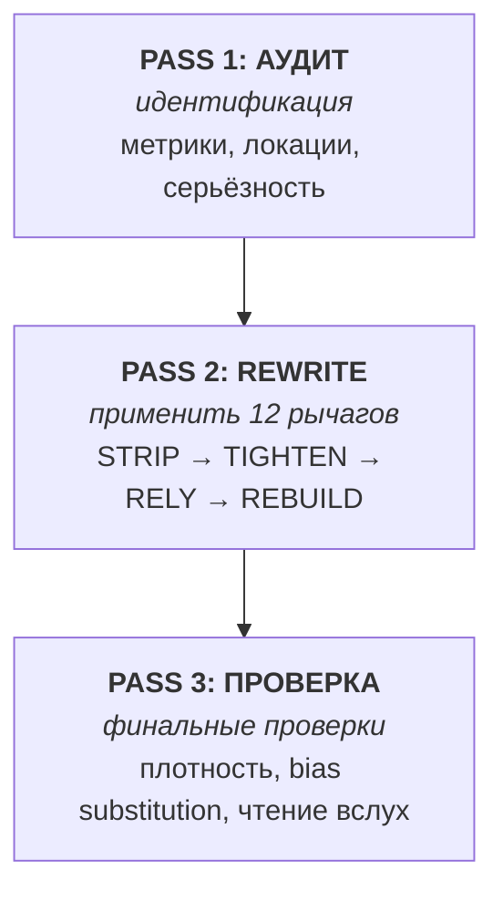

[← На главную](index)

# 🛠 Обзор скилов

> Четыре продакшн-скила. У каждого свой workflow для AI-текста, который должен читаться по-человечески.

<br>

## 🚦 Краткая сводка

| Скил | Когда грузить | Когда **не** грузить | Версия |
|---|---|---|---|
| 🖊 **`humanize-writer`** | Написание нового текста (README, доки, блог, письмо, статус) | Комментарии в коде, JSON, короткие сообщения об ошибках | v5 (3-pass) |
| ✏ **`humanize-editor`** | Переписать готовый AI-текст | Код, математика, юридические тексты | v5 (3-pass + Tighten) |
| 🔍 **`anti-ai-auditor`** | Диагностика текста без правок | Когда пользователь хочет сам rewrite | v4 (3-pass аудит) |
| 🩹 **`ai-pattern-rewriter`** | Правка одной фразы за раз | Переписывание целого документа | v4 (3-pass хирургия) |

<br>

## 📐 Архитектура: 3-pass workflow

Все скилы делят общую структуру:



<br>

## 🎯 12 рычагов в 4 фазах

| Фаза | Рычаги | Что делают |
|---|---|---|
| 🧹 **STRIP** | 1–9 | Удаляют AI-маркеры |
| 📐 **TIGHTEN** | 10 | Достаточность |
| 🧊 **RELY** | 11 | Айсберг (доверяй читателю) |
| 🇷🇺 **REBUILD** | 12 | Русская грамматика краткости (только RU) |

<details>
<summary><b>🧹 STRIP (Рычаги 1–9): убрать AI-маркеры</b></summary>

| № | Рычаг | Пример |
|---|---|---|
| 1 | **Perplexity** | `delve` → `разобраться` |
| 2 | **Burstiness** | Чередовать длины предложений (std > 5) |
| 3 | **Hedge surgery** | Удалить `можно сказать, что` |
| 4 | **Structural flatten** | Убрать раздутые буллет-списки |
| 5 | **Specificity** | `современное решение` → `p99 14ms` |
| 6 | **Voice** | Добавить «я»/«мы» где естественно |
| 7 | **Discourse** | Удалить `Более того`, `Кроме того` |
| 8 | **Punctuation** | Em-dash ≤ 1 на 300 слов |
| 9 | **RLHF strip** | Удалить `Отличный вопрос!`, `Надеюсь, поможет` |

</details>

<details>
<summary><b>📐 TIGHTEN (Рычаг 10): достаточность</b></summary>

> «Не делай свой вклад информативнее, чем требуется» — Grice submaxim 2

**8 сканов** + Strunk cut-test + Williams 6 операций:

```python
TIGHTEN_SCANS = [
    "vacuum_filling",       # P-NEW-1: вводные без информации
    "restatement",          # P-NEW-2: 2+ предложения с одинаковым содержанием
    "bridging",             # P-NEW-3: "как упоминалось выше"
    "over_explanation",     # P-NEW-4: объяснение очевидного
    "anticipatory_hedging", # P-NEW-5: "возможно, в некоторых случаях"
    "balanced_framing",     # P-NEW-6: "с одной стороны, с другой"
    "antithetical_recap",   # P-NEW-7: "итак, мы рассмотрели"
    "strunk_cut_test",      # удали любое предложение, смысл выжил?
]
```

**Bias substitution check** (Lamparth et al. 2026):

```python
def check_bias_substitution(original, rewritten):
    orig_facts = extract_facts(original)  # числа, имена, пути, команды
    new_facts = extract_facts(rewritten)
    lost = orig_facts - new_facts
    loss_pct = len(lost) / max(len(orig_facts), 1) * 100

    if loss_pct > 10:
        return {"status": "FAIL", "lost_facts": lost}
    return {"status": "PASS"}
```

</details>

<details>
<summary><b>🧊 RELY (Рычаг 11): айсберг</b></summary>

> «Если пишущий прозу знает достаточно о том, что он пишет, он может опустить то, что знает» — Хемингуэй

**Русская традиция:** Довлатов, Шукшин, Толстой (см. [laconic-prose-models](02-techniques/laconic-prose-models)).

**Условие Хемингуэя:** underspecification работает только если автор **знает** то, что не говорит.

**Тест:** удали абзац. Читатель может продолжить мысль без него? Если да — iceberg.

</details>

<details>
<summary><b>🇷🇺 REBUILD (Рычаг 12, только RU): русская грамматика краткости</b></summary>

| Приём | Что делает | Пример |
|---|---|---|
| **Парцелляция** | Расщепление | «Город стоит на реке. Отсюда — водоснабжение.» |
| **Эллипсис** | Опущение | «Я говорю по-английски, а он — по-немецки.» |
| **Литота** | Преуменьшение | «У нас пользователей — кот наплакал.» |
| **Нулевая связка** | Безличный/инфинитивный | «Пошёл в магазин. Хлеб.» |

Подробнее: [`russian-brevity-grammar`](02-techniques/russian-brevity-grammar).

</details>

<br>

## 🔍 Детали по скилам

### 🖊 `humanize-writer` — написать новый текст

**Триггеры:** «Помоги написать README» / «Набросай блог-пост про X» / «Напиши письмо Y»

```
graph LR
  A[Pre-flight:<br/>голос, лид, числа] --> B[Draft full text]
  B --> C[Audit pass]
  C --> D[Tighten pass]
  D --> E[Rupture / Trust reader]
  E --> F[Density check]
```

[Полное содержимое скила →](skills-overview) · [Исходник на GitHub](https://github.com/11111000000/agents-writing-skills/tree/main/skills/humanize-writer)

### ✏ `humanize-editor` — переписать готовое

**Триггеры:** «Сделай этот текст менее AI» / «Перепиши мой черновик» / «Гуманизируй это»

Отличается от `humanize-writer` тем, что **обязан сохранять смысл**. Добавляет:
- Bias substitution check (после Tighten pass)
- Выбор voice profile (casual / professional / technical / warm / blunt / laconic)

[Исходник на GitHub →](https://github.com/11111000000/agents-writing-skills/tree/main/skills/humanize-editor)

### 🔍 `anti-ai-auditor` — диагностика

**Триггеры:** «Это слишком AI?» / «Проверь этот черновик» / «Сравни две версии»

Выдаёт структурированный отчёт:
- Вердикт (Human-leaning / Mixed / AI-leaning / Strongly AI)
- Risk score 0–100
- Разбивка по метрикам (AP, D, E, YapScore)
- Риск по абзацам + конкретные места проблем
- Топ-3-5 actionable рекомендаций

[Исходник на GitHub →](https://github.com/11111000000/agents-writing-skills/tree/main/skills/anti-ai-auditor)

### 🩹 `ai-pattern-rewriter` — хирургическая правка

**Триггеры:** «Поправь только это предложение» / «Замени только 7-ю строку» / «Сделай эту фразу менее AI»

Отличается от `humanize-editor` тем, что трогает **только отмеченные spans**. Добавляет per-span проверку bias substitution.

[Исходник на GitHub →](https://github.com/11111000000/agents-writing-skills/tree/main/skills/ai-pattern-rewriter)

<br>

## 📦 Companion промпты (только pi)

| Промпт | Назначение |
|---|---|
| `/humanize` | Полный rewrite через промпт |
| `/audit-ai` | Диагностический отчёт |
| `/audit-43` | Полный аудит по 43 паттернам |
| `/humanize-9-levers` | Применить только 9 исходных рычагов |
| `/anti-thesis` | Детектировать «Это не X, а Y» |
| `/writer-voice` | Написать новый текст через промпт |
| `/clean-draft` | Лёгкая чистка |
| `/rewrite-ai` | Хирургическая правка фразы через промпт |
| `/honest-check` | Pre-flight проверка применимости скила |

<br>

## 🤝 Совместимость

| Агент | Скилы | Промпты | Статус |
|---|---|---|---|
| **opencode** | ✓ | n/a | ✅ Тестировано |
| **pi** | ✓ | ✓ | ✅ Тестировано |
| **Claude Code** | ✓ | n/a | ✅ Работает |
| **Codex CLI** | ✓ | вручную | ✅ Работает |
| Другой с поддержкой Agent Skills | ✓ | вручную | ✅ Совместимо |

Все скилы соответствуют стандарту [Agent Skills](https://agentskills.io/specification): YAML frontmatter с `name` и `description`, тело в Markdown.

<br>

[← На главную](index) · [Далее: База знаний →](knowledge-base)
