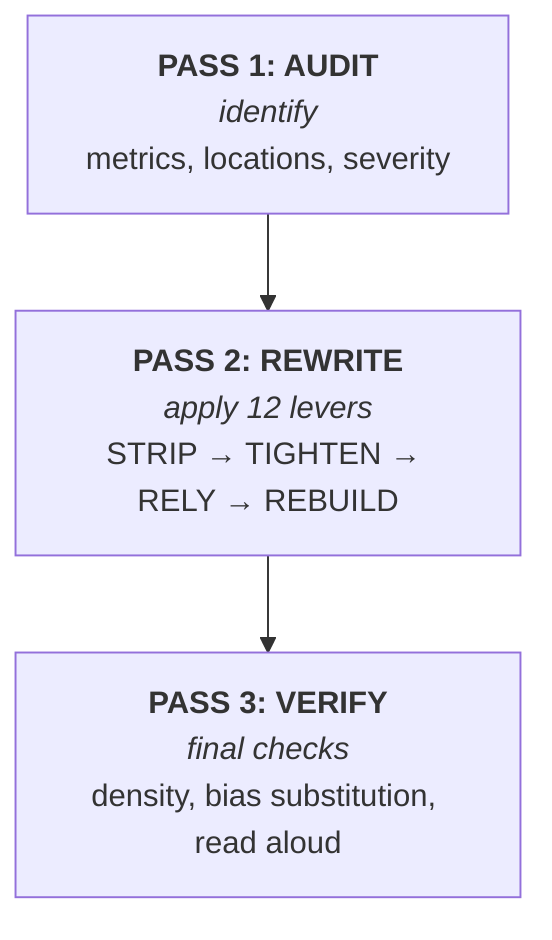

[← Back to Home](index)

# 🛠 Skills Overview

> Four production skills. Each encodes a workflow for AI-text that reads human.

<br>

## 🚦 Quick reference

| Skill | When to load | When **NOT** to load | Version |
|---|---|---|---|
| 🖊 **`humanize-writer`** | Writing new prose (README, docs, blog, email, status) | Code comments, JSON, short error messages | v5 (3-pass) |
| ✏ **`humanize-editor`** | Rewriting existing AI-sounding text | Code, math, legal text | v5 (3-pass + Tighten) |
| 🔍 **`anti-ai-auditor`** | Diagnosing text without changing it | When user wants actual rewrite | v4 (3-pass audit) |
| 🩹 **`ai-pattern-rewriter`** | Fixing one phrase at a time | Whole-document rewrites | v4 (3-pass surgical) |

<br>

## 📐 Architecture: 3-pass workflow

All skills share the same overall structure:



<br>

## 🎯 12 levers in 4 phases

| Phase | Levers | What they do |
|---|---|---|
| 🧹 **STRIP** | 1-9 | Remove AI tells |
| 📐 **TIGHTEN** | 10 | Sufficiency |
| 🧊 **RELY** | 11 | Iceberg (trust the reader) |
| 🇷🇺 **REBUILD** | 12 | Russian brevity grammar (RU only) |

<details>
<summary><b>🧹 STRIP (Levers 1-9): remove AI tells</b></summary>

| # | Lever | Example |
|---|---|---|
| 1 | **Perplexity** | Replace `delve` with `look at` |
| 2 | **Burstiness** | Vary sentence length (std > 5) |
| 3 | **Hedge surgery** | Remove `it could be argued that` |
| 4 | **Structural flatten** | Drop bullet-list bloat |
| 5 | **Specificity** | Replace `modern solution` with `p99 14ms` |
| 6 | **Voice** | Add first-person where natural |
| 7 | **Discourse** | Cut `Furthermore`, `Moreover` |
| 8 | **Punctuation** | Em-dash ≤ 1 per 300 words |
| 9 | **RLHF strip** | Drop `Great question!`, `I hope this helps` |

</details>

<details>
<summary><b>📐 TIGHTEN (Lever 10): sufficiency</b></summary>

> «Do not make your contribution more informative than is required» — Grice submaxim 2

**8 scans** + Strunk cut-test + Williams 6 operations:

```python
TIGHTEN_SCANS = [
    "vacuum_filling",       # P-NEW-1: вводные без информации
    "restatement",          # P-NEW-2: 2+ предложения с одинаковым содержанием
    "bridging",             # P-NEW-3: "как упоминалось выше"
    "over_explanation",     # P-NEW-4: объяснение очевидного
    "anticipatory_hedging", # P-NEW-5: "возможно, в некоторых случаях"
    "balanced_framing",     # P-NEW-6: "с одной стороны, с другой"
    "antithetical_recap",   # P-NEW-7: "итак, мы рассмотрели"
    "strunk_cut_test",      # удали любое предложение, смысл выжил?
]
```

**Bias substitution check** (Lamparth et al. 2026):

```python
def check_bias_substitution(original, rewritten):
    orig_facts = extract_facts(original)  # numbers, names, paths, commands
    new_facts = extract_facts(rewritten)
    lost = orig_facts - new_facts
    loss_pct = len(lost) / max(len(orig_facts), 1) * 100

    if loss_pct > 10:
        return {"status": "FAIL", "lost_facts": lost}
    return {"status": "PASS"}
```

</details>

<details>
<summary><b>🧊 RELY (Lever 11): iceberg</b></summary>

> «If a writer knows enough of what he is writing about he may omit things that he knows» — Hemingway

**Russian tradition:** Довлатов, Шукшин, Толстой (см. [laconic-prose-models](02-techniques/laconic-prose-models)).

**Условие Хемингуэя:** underspecification работает только если автор **знает** то, что не говорит.

**Test:** удали абзац. Читатель может продолжить мысль без него? Если да — iceberg.

</details>

<details>
<summary><b>🇷🇺 REBUILD (Lever 12, RU only): Russian brevity grammar</b></summary>

| Приём | Что делает | Пример |
|---|---|---|
| **Парцелляция** | Расщепление | «Город стоит на реке. Отсюда — водоснабжение.» |
| **Эллипсис** | Опущение | «Я говорю по-английски, а он — по-немецки.» |
| **Литота** | Преуменьшение | «У нас пользователей — кот наплакал.» |
| **Нулевая связка** | Безличный/инфинитивный | «Пошёл в магазин. Хлеб.» |

Подробнее: [`russian-brevity-grammar`](02-techniques/russian-brevity-grammar).

</details>

<br>

## 🔍 Skill details

### 🖊 `humanize-writer` — write new prose

**Triggers:** "Help me write a README" / "Draft a blog post about X" / "Write an email to Y"

```
graph LR
  A[Pre-flight:<br/>voice, lead, numbers] --> B[Draft full text]
  B --> C[Audit pass]
  C --> D[Tighten pass]
  D --> E[Rupture / Trust reader]
  E --> F[Density check]
```

[Full content in skill →](skills-overview) · [Source code on GitHub](https://github.com/11111000000/agents-writing-skills/tree/main/skills/humanize-writer)

### ✏ `humanize-editor` — rewrite existing

**Triggers:** "Make this text sound less AI" / "Rewrite my draft" / "Humanize this"

Differs from `humanize-writer` in that it must **preserve meaning**. Adds:
- Bias substitution check (after Tighten pass)
- Voice profile selection (casual/professional/technical/warm/blunt/laconic)

[Source on GitHub →](https://github.com/11111000000/agents-writing-skills/tree/main/skills/humanize-editor)

### 🔍 `anti-ai-auditor` — diagnose

**Triggers:** "Is this too AI?" / "Check this draft" / "Compare two versions"

Outputs structured report:
- Verdict (Human-leaning / Mixed / AI-leaning / Strongly AI)
- Risk score 0-100
- Metrics breakdown (AP, D, E, YapScore)
- Per-paragraph risk + location-tagged issues
- Top 3-5 concrete recommendations

[Source on GitHub →](https://github.com/11111000000/agents-writing-skills/tree/main/skills/anti-ai-auditor)

### 🩹 `ai-pattern-rewriter` — surgical fix

**Triggers:** "Fix just this sentence" / "Replace only line 7" / "Make this one phrase less AI"

Differs from `humanize-editor` in that it touches **only flagged spans**. Adds per-span bias substitution check.

[Source on GitHub →](https://github.com/11111000000/agents-writing-skills/tree/main/skills/ai-pattern-rewriter)

<br>

## 📦 Companion prompts (pi only)

| Prompt | Purpose |
|---|---|
| `/humanize` | Full rewrite via prompt |
| `/audit-ai` | Diagnostic report |
| `/audit-43` | Full 43-pattern audit |
| `/humanize-9-levers` | Apply only the 9 original levers |
| `/anti-thesis` | Detect «Это не X, а Y» patterns |
| `/writer-voice` | Write new prose via prompt |
| `/clean-draft` | Light cleanup |
| `/rewrite-ai` | Surgical phrase fix via prompt |
| `/honest-check` | Pre-flight check on skill applicability |

<br>

## 🤝 Compatibility

| Agent | Skills | Prompts | Status |
|---|---|---|---|
| **opencode** | ✓ | n/a | ✅ Tested |
| **pi** | ✓ | ✓ | ✅ Tested |
| **Claude Code** | ✓ | n/a | ✅ Works |
| **Codex CLI** | ✓ | manual | ✅ Works |
| Other Agent Skills-compatible | ✓ | manual | ✅ Compatible |

All skills use the [Agent Skills standard](https://agentskills.io/specification): YAML frontmatter with `name` and `description`, Markdown body.

<br>

[← Back to Home](index) · [Next: Knowledge Base →](knowledge-base)